## About this lecture
>

+ What will be covered:
  + Usual works
  + Common issues encountered in usual works
  
---

+ What will NOT be covered:
  + Dynamic graphing: refer to `ggvis`, `rCharts`, or `googleVis`
  + Map graphing: refer to `ggmap`
  + Data preprocessing
  + PIE CHART (I'm sorry.)

--- .segue .nobackground .dark

## Basic Syntax

--- 

## ggplot(data, aes(x, y, group, ...)) + geom_object(...)

+ All you need is the function `ggplot`
    + There is also a quick and dirty `qplot` (not recommended)
+ Usage:
    + data: an object of class `data.frame`; **data** to be plotted
    + aes: a function that returns aesthetic mappings; **variables** to be plotted
    + geom_object: geometric objects; the **type** of plot
        + `geom_bar()`, `geom_line()`, `geom_point()`, ...
        
---
        
+ Example:

```r
library(ggplot2)
ggplot(data=iris, aes(x=Sepal.Length, y=Sepal.Width)) + geom_point()
```

---

## Example plotted


---

## Factor or Numeric?
+ Variable class affects `ggplot`'s behavior
+ Variable class affects `ggplot`'s behavior. **Twice**.
+ Always check your data.frame (use `str` or `class`) before calling `ggplot`

--- .segue .nobackground .dark

## Bar Plot

---

## Bar Plot: Let's do this in `ggplot2`...

```r
siris <- iris[iris$Sepal.Length > median(iris$Sepal.Length),]
barplot(table(siris$Species))
```

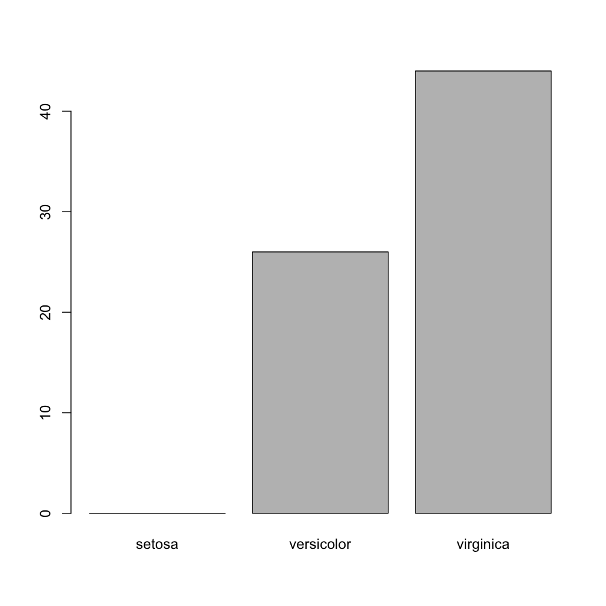

---

## Before we get the job done...
+ Let's take a look at the help page of `graphics::barplot`

<div style='text-align: center;'>
    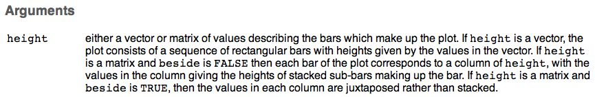
</div>

+ `graphics::barplot` provides a flexability of different class/format of input
+ And this is good, in general
+ Ineed, all plotting function in `graphics` provide more or less flexability about the input data
+ The problem is, they differ from each other about how flexability is defined
+ When it comes to `ggplot2`, all plotting functions share the same behavior

---

## Back to the job: Oops, Setosa is missing...

```r
ggp <- ggplot(data=siris, aes(x=Species))
ggp + geom_bar()
```

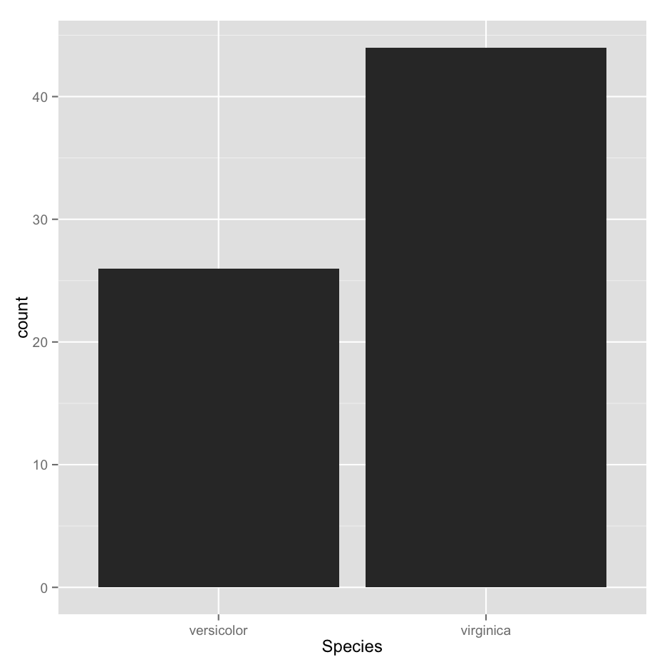

---

## Force display of x-labels

```r
ggp <- ggp + scale_x_discrete(drop=FALSE) # keep zero-occurence variable
ggp + geom_bar()
```


---

## Change labels!

```r
ggp <- ggp + ylab('Count') + ggtitle('Hello ggplot!')
ggp + geom_bar()
```

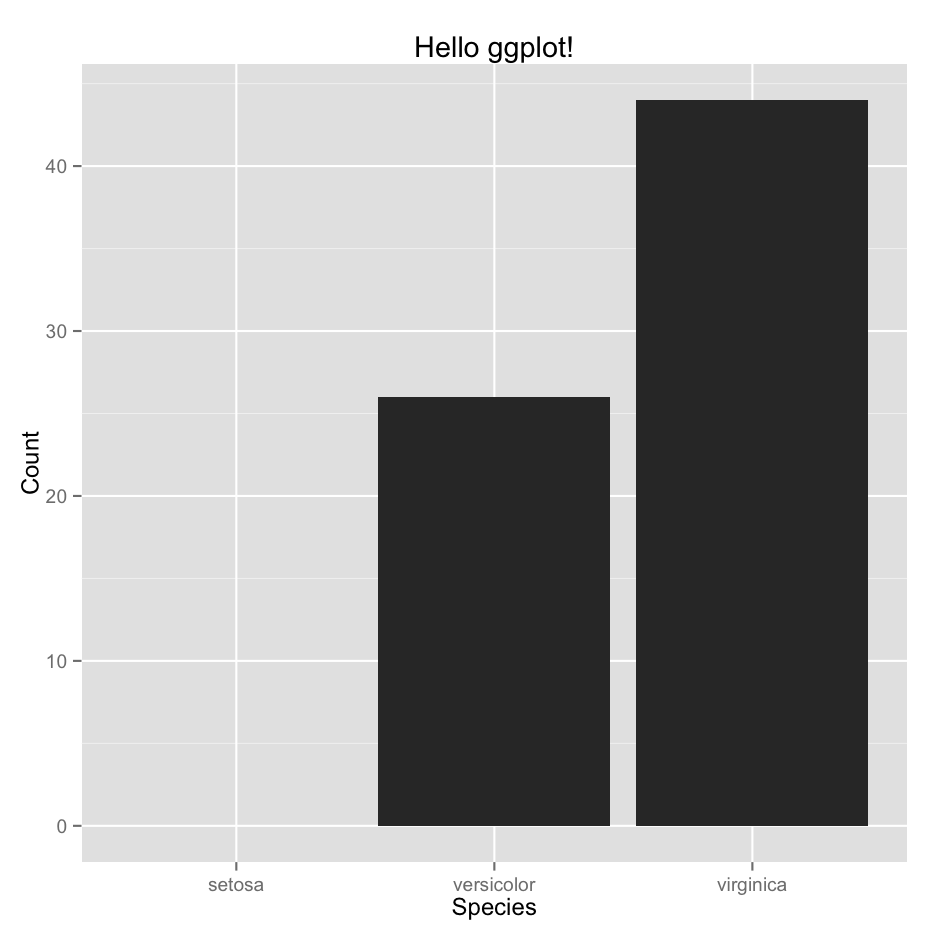

---

## Change colors!

```r
# want to customize colors? refer to: www.cookbook-r.com/Graphs/Colors_(ggplot2)/
ggp + geom_bar(fill='snow', color='black') # see colors() if you're picky
```

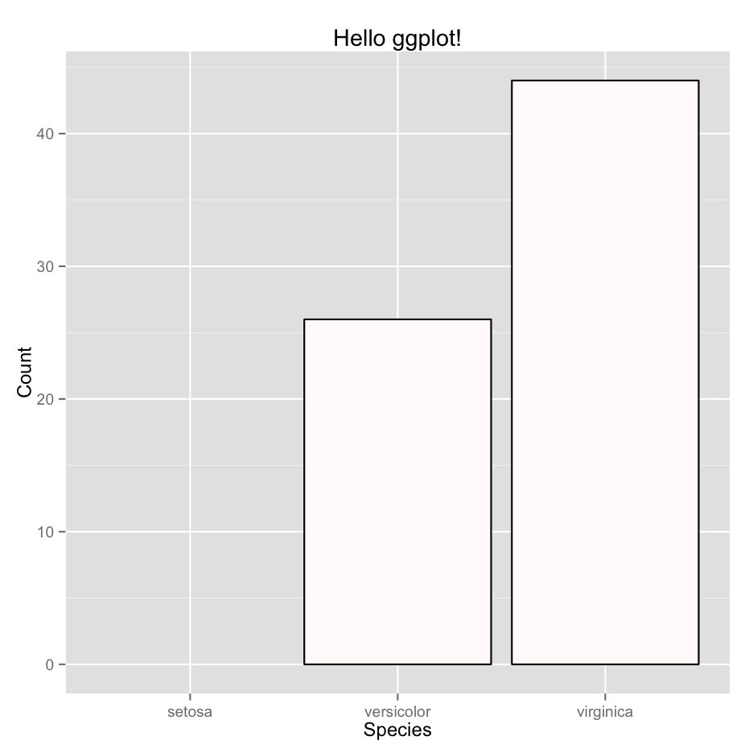

--- &twocol

## When counts are pre-calculated...


```r
precounted <- as.data.frame(table(siris$Species, dnn=c('Species')))
ggplot(precounted, aes(x=Species, y=Freq)) + geom_bar(stat='identity')
```

*** =left
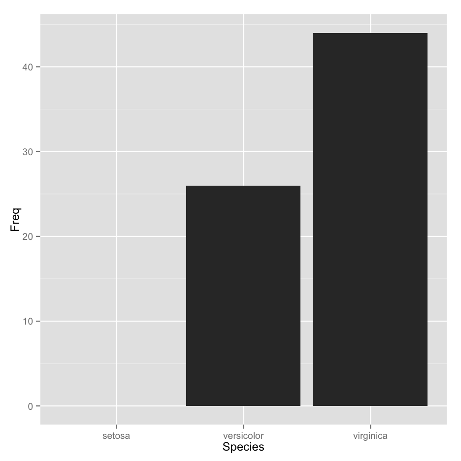

*** =right

```
##      Species Freq
## 1     setosa    0
## 2 versicolor   26
## 3  virginica   44
```
+ Row must be unique
  + Otherwise counts will be summed up
+ 0-occurence label will be present at default
  + Differ from `stat='bin'`
+ Negative bar is allowed

---

## Reorder x

```r
ggplot(precounted, aes(x=reorder(Species, -Freq), y=Freq)) + 
  geom_bar(stat='identity') # The order is determined by factor levels
```


---

## Grouping: By Stacking

```r
siris <- dplyr::mutate(siris, Fat=(Sepal.Width > median(Sepal.Width)))
# siris <- within(siris, Fat <- (Sepal.Width > median(Sepal.Width)))
ggp_bygrp <- ggplot(siris, aes(x=Species, fill=Fat)); ggp_bygrp + geom_bar()
```

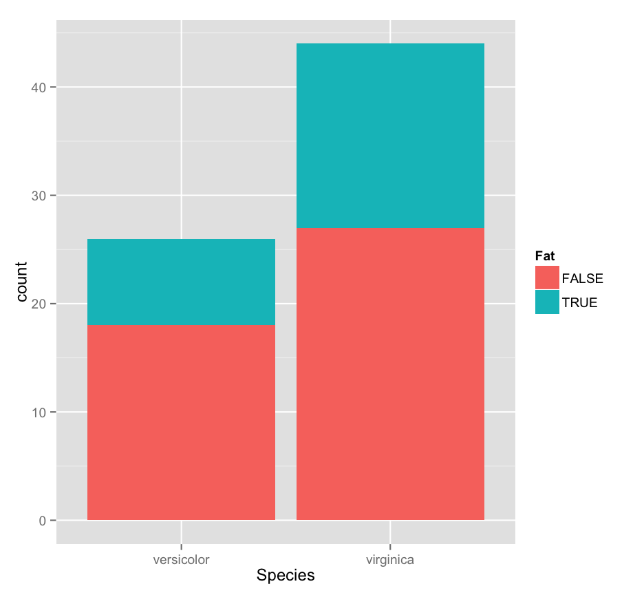

---

## Change grouping var from `fill` to `color`...
# Well, you should not be surprised by now

```r
# see ?aes_colour_fill_alpha for more about color grouping
ggplot(siris, aes(x=Species, color=Fat)) + geom_bar()
```


---

## Grouping: By Dodging

```r
ggp_bygrp + geom_bar(position='dodge') # ggp_bygrp + geom_bar(position=position_dodge(1))
```

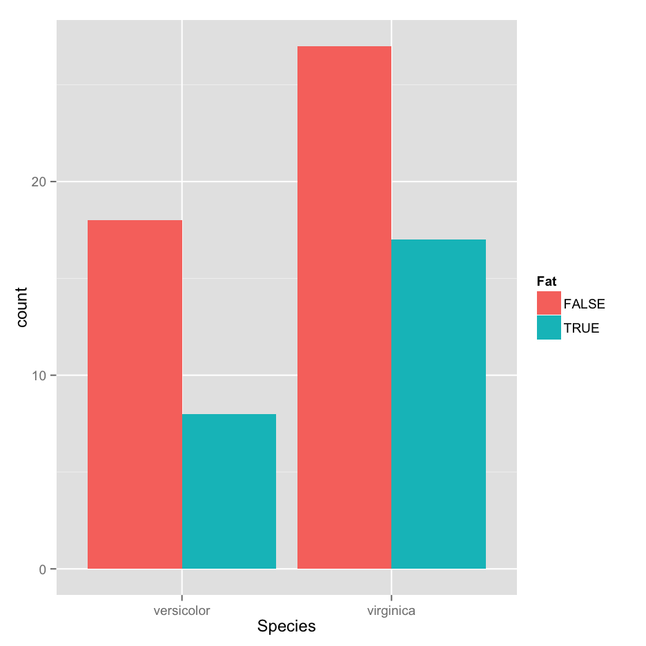

---

## What if x is continuous...

```r
ggplot(iris, aes(x=Sepal.Length)) + geom_bar() # a HISTOGRAM indeed!
```

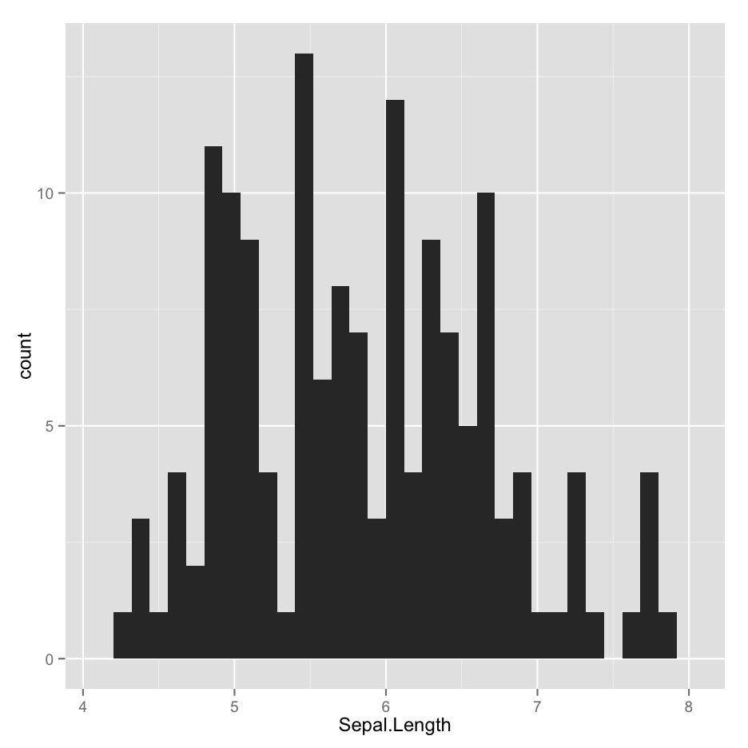

---

## Histogram Grouping: By Overlapping

```r
ggplot(iris, aes(x=Sepal.Length, fill=Species)) + 
  geom_bar(position='identity', alpha=.4) # now we have seen stack, dodge, and identity
```

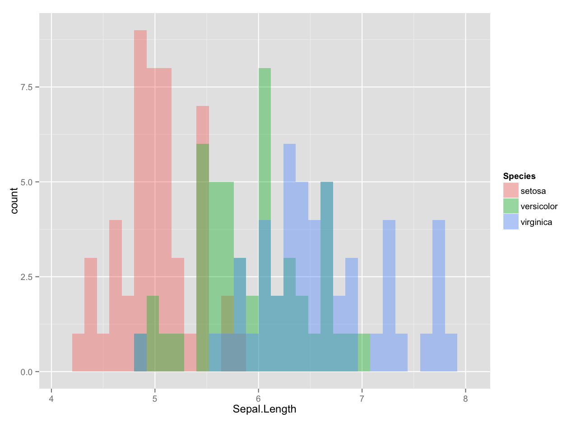

---

## Exercise Time!
> "God Help Those Who Help Themselves."

+ **Q.1**: Exactly how many `position`s do we have in `ggplot2`?
+ **Q.2**: What will happen if we plot the grouping barplot by position `identity`?
+ **Hint**: 
  + We've already seen grouping by `stack`ing and `dodge`ing:

```r
# use constant
ggplot(siris, aes(x=Species, fill=Fat)) + geom_bar(position='dodge') 
# or default full function call to the specific position
ggplot(siris, aes(x=Species, fill=Fat)) + geom_bar(position=position_dodge()) 
```

---

## Overlapping Density

```r
ggplot(iris, aes(x=Sepal.Length, fill=Species)) + 
  geom_density(position='identity', alpha=.4) # simply change geom_bar to geom_density
```


---

## Overlapping Histogram with Density... Oops!

```r
ggplot(iris, aes(x=Sepal.Length, fill=Species)) + 
  geom_bar(position='identity', alpha=.4) + geom_density(position='identity', alpha=.4)
```


---

## Overlapping Histogram with Density

```r
ggplot(iris, aes(x=Sepal.Length, y=..density.., fill=Species)) + 
  geom_bar(position='identity', alpha=.4) + geom_density(position='identity', alpha=.4)
```


---

## Exercise: Working hours by industry?

```r
data("salary", package="DSC2014Tutorial") # or load('salary.RData')
par(family='Heiti TC Light') # for OS X (XQuartz device)
hist(salary_2013$平均工時, main=NULL)
```


---

## Exercise: Try to plot this!


---

## Exercise: Answer

```r
ggplot(salary_2013, aes(x=reorder(行業,-平均工時), y=平均工時)) + # reorder x  
  geom_bar(stat='identity', alpha=.5) + # set transparency  
  labs(x='行業別', y='平均月（加班）工時', title='正常工時（虛）與加班工時（實）') +  
  theme(# for OS X (XQuartz device) to show Chinese characters
        text=element_text(family='Heiti TC Light'), 
        # rotate angle of x ticks
        axis.text.x=element_text(angle=90, hjust=1, vjust=.5),
        # change size of title
        plot.title=element_text(size=26)) +
  
  # argument data is skipped in the second call to geom_bar
  geom_bar(aes(x=行業, y=as.numeric(as.character(加班工時))), stat='identity') +
  
  # add arbitrary text (refer to the bonus section of this lecture)
  annotate('text', label='囧', color='red', family='Heiti TC Light', size=10, vjust=-.25,
           x=which(levels(reorder(salary_2013$行業,-salary_2013$平均工時)) == '製造業'), 
           y=as.numeric(as.character(salary_2013[salary_2013$行業=='製造業', '加班工時'])))
```

---

## A Digress: Export your plot as external file
+ Mehtods in `graphics` will NOT work
+ `ggplot2` has its own interface for saving plots as external files
  + Refer to`?ggsave` for more details
  + Example:

```r
aggplot <- ggplot(iris, aes(x=Sepal.Length, fill=Species)) + geom_bar()
ggsave(filename='your_file_name.png', plot=aggplot)

# the device used is auto determined by the filename extension
# if plot is not specified, the last plot displayed will be saved
```

--- &twocol

## Proportional Stacking
> Yet another challenge. How to do this?

*** =left
+ Before...

*** =right
+ After...
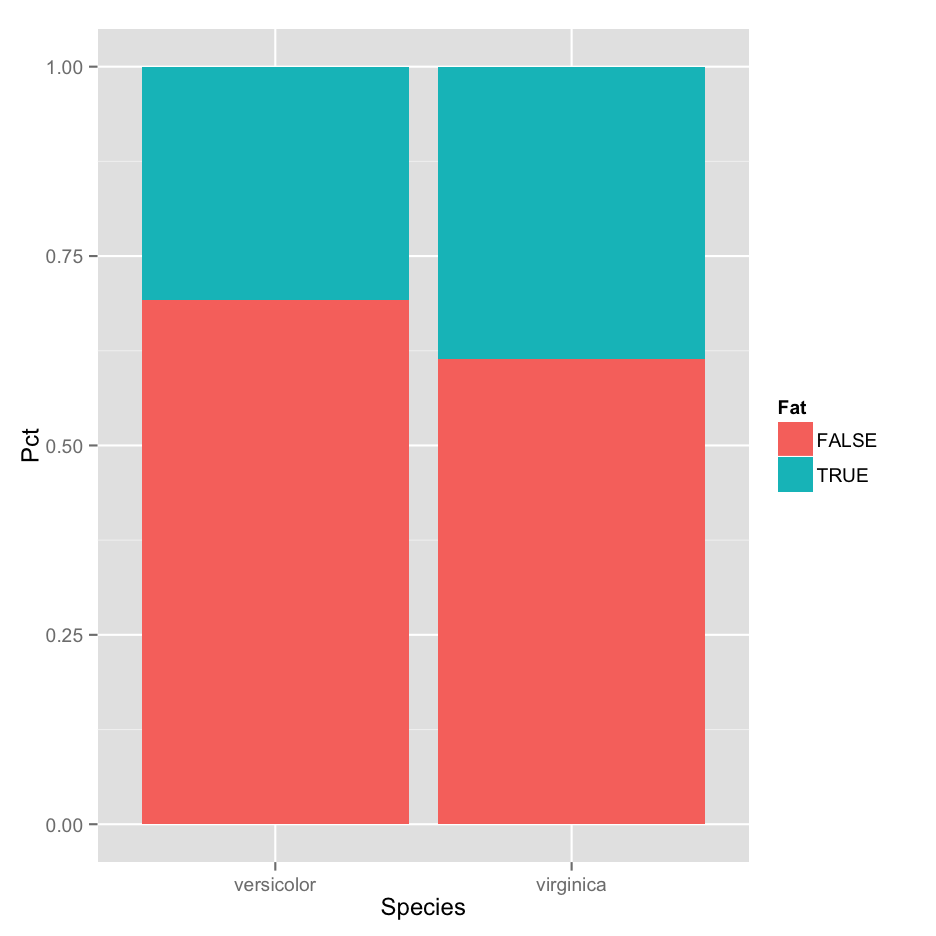

---

## Proportional Stacking: Need Preprocessing
+ Unfortunately, no built-in automation available!
+ Have to precompute the percentage in column, and then use `stat='identity'`

```r
head(siris)[,1:5]
```

```
##   Sepal.Length Sepal.Width Petal.Length Petal.Width    Species
## 1          7.0         3.2          4.7         1.4 versicolor
## 2          6.4         3.2          4.5         1.5 versicolor
## 3          6.9         3.1          4.9         1.5 versicolor
## 4          6.5         2.8          4.6         1.5 versicolor
## 5          6.3         3.3          4.7         1.6 versicolor
## 6          6.6         2.9          4.6         1.3 versicolor
```

---

## Proportional Stacking: Preprocessing 
# Solution 1: Old-school (built-in methods only)

```r
siris$Count <- 0L
siris_ag <- aggregate(data=siris, Count ~ Species + Fat, FUN=length)
siris_ag <- do.call(rbind, lapply(split(siris_ag, siris_ag$Species), 
                                  function(x) within(x, Pct <- Count/sum(Count))))
rownames(siris_ag) <- NULL
siris_ag
```

```
##      Species   Fat Count    Pct
## 1 versicolor FALSE    18 0.6923
## 2 versicolor  TRUE     8 0.3077
## 3  virginica FALSE    27 0.6136
## 4  virginica  TRUE    17 0.3864
```

---

## Proportional Stacking: Preprocessing 
# Solution 2: the fancy `dplyr` package

```r
library(dplyr)
siris_ag <- summarise(group_by(siris, Species, Fat), Count=n())
siris_ag <- mutate(siris_ag, Pct=Count/sum(Count))
siris_ag
```

```
## Source: local data frame [4 x 4]
## Groups: Species
## 
##      Species   Fat Count    Pct
## 1 versicolor FALSE    18 0.6923
## 2 versicolor  TRUE     8 0.3077
## 3  virginica FALSE    27 0.6136
## 4  virginica  TRUE    17 0.3864
```

---

## Proportional Stacking: Preprocessing 
# Solution 3: `data.table` magic

```r
library(data.table)
siris_ag <- as.data.table(siris)
siris_ag <- siris_ag[,list(Count=.N), by='Species,Fat'][
                     ,Pct:=Count/sum(Count), by='Species']
# result not shown to save space
```

# Solution 4: forever SQL

```r
options(gsubfn.engine='R'); library(sqldf)
tmp1 <- sqldf('select Species, Fat, count(*) as Count from siris group by Species, Fat')
tmp2 <- sqldf('select Species, sum(Count) as cnt_by_species from tmp1 group by Species')
sqldf('select tmp1.Species, Fat, Count, (Count*1.0 / cnt_by_species) as Pct 
       from tmp1 join tmp2 on tmp1.Species = tmp2.Species') -> siris_ag
# result not shown to save space
```

---

## Proportional Stacking Bar, Finally!

```r
ggplot(siris_ag, aes(x=Species, y=Pct, fill=Fat)) + geom_bar(stat='identity')
```


---

## Bar Plot with Annotation (1/2)

```r
ggplot(siris_ag, aes(x=Species, y=Pct, fill=Fat)) + geom_bar(stat='identity') +
  geom_text(aes(y=Pct, label=Count), color='white') # notice that 'color' is outside aes()
```


---

## Bar Plot with Annotation (2/2)

```r
library(dplyr); siris_ag <- mutate(group_by(siris_ag, Species), Cum.Pct=cumsum(Pct))
ggplot(siris_ag, aes(x=Species, y=Pct, fill=Fat)) + geom_bar(stat='identity') +
  geom_text(aes(y=Cum.Pct, label=Count), color='white', vjust=1.5)
```

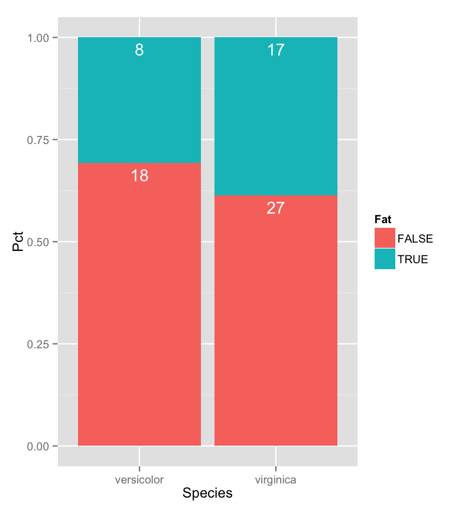

---

<p style='text-align: center; font-size: 40pt;'>Stop. I'm SICK about bar plot.</p>
<br>
<br>
<div style='text-align: center;'>
    
</div>

--- .segue .nobackground .dark

## Line Graph

---

## It's just that simple!

```r
# not meaningful but plottable
ggplot(iris, aes(x=Sepal.Width, y=Sepal.Length)) + geom_line() 
```

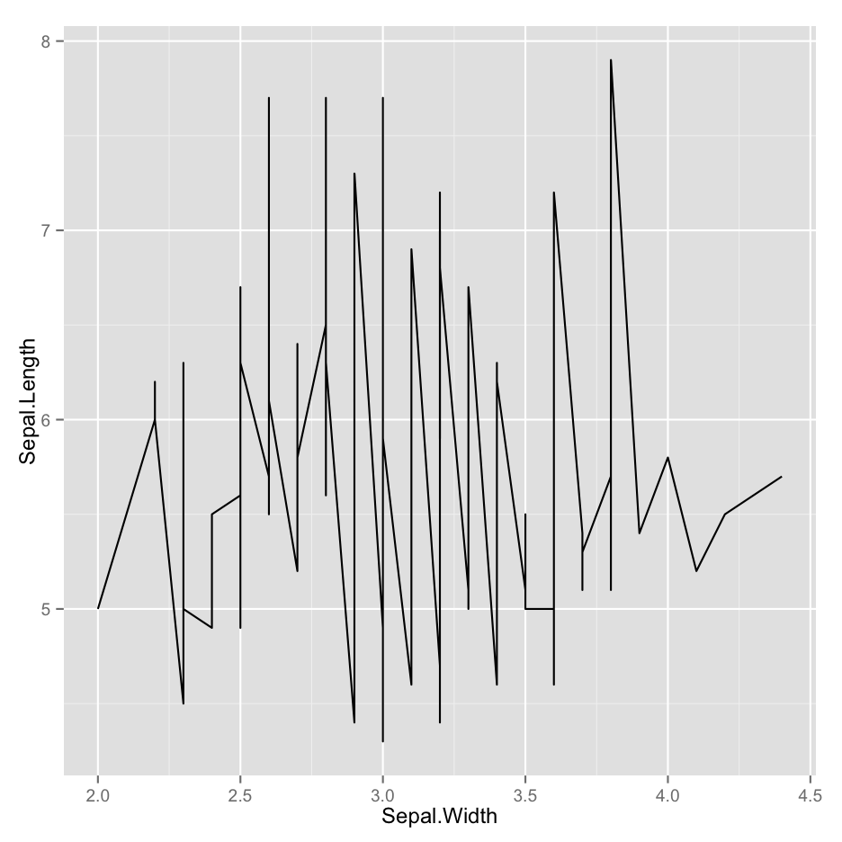

---

<p style='text-align: center; font-size: 40pt;'>AND I am sick about IRIS, too.</p>
<br>
<br>
<div style='text-align: center;'>
    
</div>

---

## A Digress: Function Equivalency in `ggplot2`
+ Mnay of the parameters can be applied in multiple ways
  + 
  + `ggtitle('yor title')` is the same as `labs(title='your title')`
  + See `?labs` for its equivalent calls
+ Many of the functions are siblings of a more general function
  + `geom_vline` is the sibling of `geom_abline`
  + `theme_bw` is a special version of `theme`
    + The default is `theme_grey`

---

## Let's try another sameple data

```r
WorldPhones
str(WorldPhones)
```

```
##      N.Amer Europe Asia S.Amer Oceania Africa Mid.Amer
## 1951  45939  21574 2876   1815    1646     89      555
## 1956  60423  29990 4708   2568    2366   1411      733
## 1957  64721  32510 5230   2695    2526   1546      773
## 1958  68484  35218 6662   2845    2691   1663      836
## 1959  71799  37598 6856   3000    2868   1769      911
## 1960  76036  40341 8220   3145    3054   1905     1008
## 1961  79831  43173 9053   3338    3224   2005     1076
```

```
##  num [1:7, 1:7] 45939 60423 64721 68484 71799 ...
##  - attr(*, "dimnames")=List of 2
##   ..$ : chr [1:7] "1951" "1956" "1957" "1958" ...
##   ..$ : chr [1:7] "N.Amer" "Europe" "Asia" "S.Amer" ...
```

---

## `ggplot`: data.frame only, please!

```r
ggplot(WorldPhones, aes(x=rownames(WorldPhones), y=Asia)) + geom_line()
```

```
## Error: ggplot2 doesn't know how to deal with data of class matrix
```
+ Remember: `ggplot` eat only data.frames

```r
WorldPhones.DF <- as.data.frame(WorldPhones)
WorldPhones.DF$year <- rownames(WorldPhones.DF)
class(WorldPhones.DF) # this time we should be fine!
```

```
## [1] "data.frame"
```

---

## What the...?

```r
ggplot(WorldPhones.DF, aes(x=year, y=Asia)) + geom_line()
```

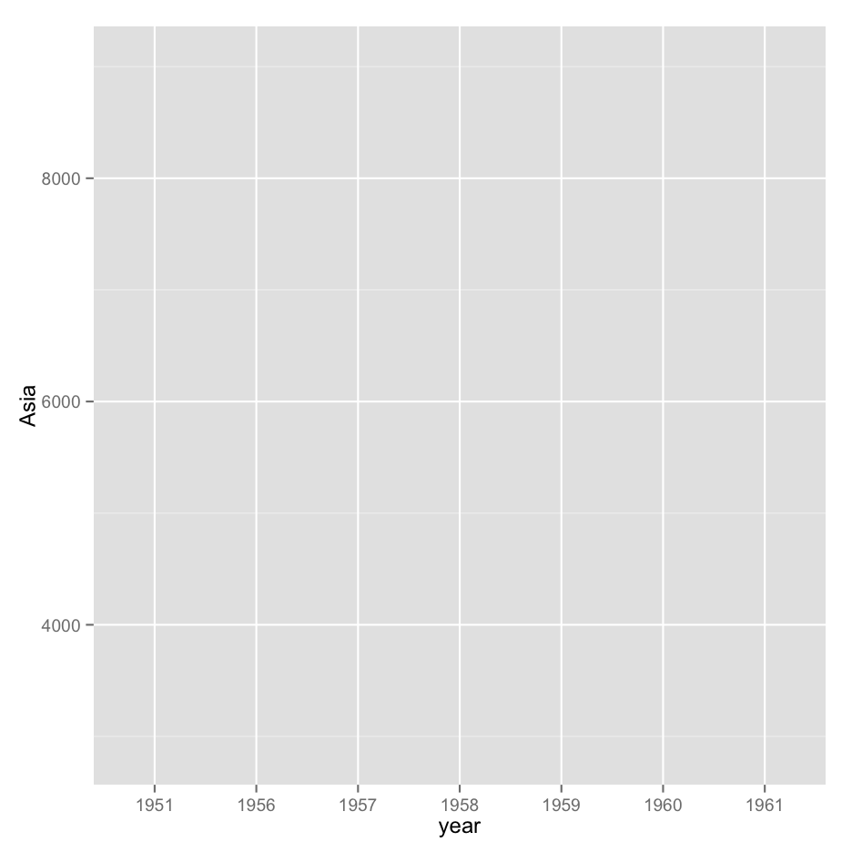

---

## Correct the discrete-x issue

```r
ggplot(WorldPhones.DF, aes(x=year, y=Asia, group=1)) + geom_line()
```


---

## Or simply make x continous, if possible

```r
ggplot(WorldPhones.DF, aes(x=as.numeric(year), y=Asia)) + geom_line()
```


--- &twocol

## Wait a minute...
Were they really drawn from the same data?
*** =left


*** =right


--- &twocol

## Can you see the difference?
Remember? Categorical x at default will not show null data.
*** =left


*** =right
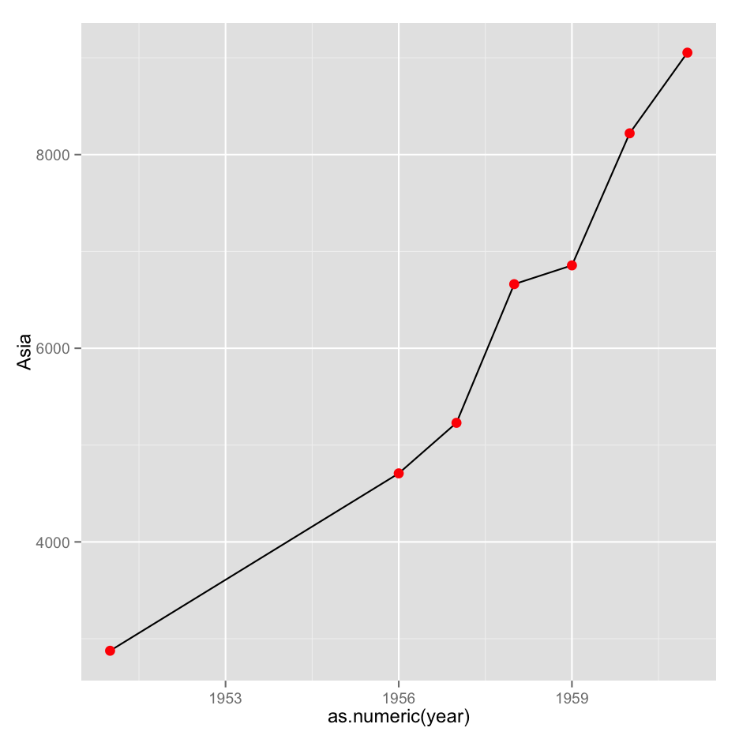

---

## Multi-lining using `graphics::matplot`

```r
matplot(x=WorldPhones.DF$year, y=WorldPhones.DF[,1:3], type='l', lty=1, col=1:3)
legend('topleft', legend=colnames(WorldPhones.DF)[1:3], lty=1, col=1:3)
```

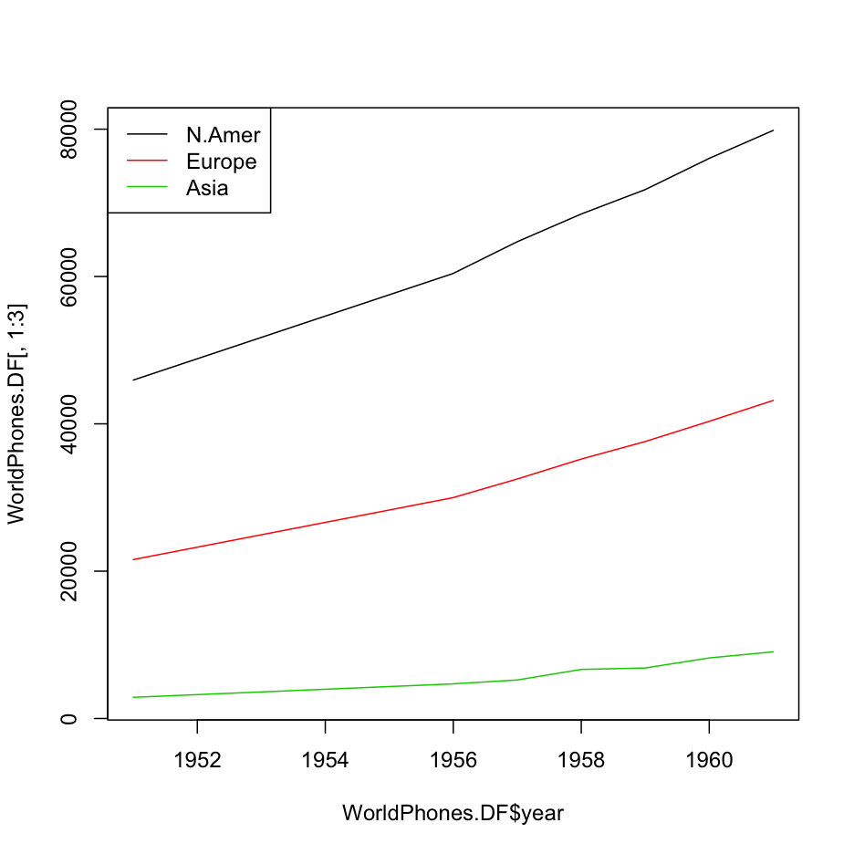

--- &twocol

## Multi-lining in `ggplot2`
+ Not straightforward, usually need preprocessing
  + Only accept **long** format, against the **wide** format used in `matplot`

*** =left
Wide format

```
##      N.Amer Europe Asia year
## 1951  45939  21574 2876 1951
## 1956  60423  29990 4708 1956
## 1957  64721  32510 5230 1957
## 1958  68484  35218 6662 1958
## 1959  71799  37598 6856 1959
## 1960  76036  40341 8220 1960
## 1961  79831  43173 9053 1961
```

*** =right
Long format

```
##    Value Region Year
## 1  45939 N.Amer 1951
## 2  60423 N.Amer 1956
## 3  64721 N.Amer 1957
## 4  68484 N.Amer 1958
## 5  71799 N.Amer 1959
## 6  76036 N.Amer 1960
## 7  79831 N.Amer 1961
## 8  21574 Europe 1951
## 9  29990 Europe 1956
## 10 32510 Europe 1957
```

---

## Wide-to-long Conversion

```r
# solution 1: use stack
WP <- WorldPhones.DF[, c(1:3, 8)]
WP.long <- cbind(stack(WP[, 1:3]), WP$year)
colnames(WP.long) <- c('Value', 'Region', 'Year')

# solution 2: use reshape
WP.long2 <- reshape(WP, direction='long', varying=list(names(WP)[1:3]), v.names='Value',
                   idvar='year', times=names(WP)[1:3], timevar='Region')

identical(WP.long$Value, WP.long2$Value)
```

```
## [1] TRUE
```
+ Don't like old-school style? Refer to `reshape2::melt`

--- &twocol

## The rest is easy!

```r
WP.long$Year <- as.integer(as.character(WP.long$Year))
ggplot(WP.long, aes(x=Year, y=Value, color=Region)) + geom_line()
```

*** =left

```r
WP.long[1:12,]
```

```
##    Value Region Year
## 1  45939 N.Amer 1951
## 2  60423 N.Amer 1956
## 3  64721 N.Amer 1957
## 4  68484 N.Amer 1958
## 5  71799 N.Amer 1959
## 6  76036 N.Amer 1960
## 7  79831 N.Amer 1961
## 8  21574 Europe 1951
## 9  29990 Europe 1956
## 10 32510 Europe 1957
## 11 35218 Europe 1958
## 12 37598 Europe 1959
```

*** =right
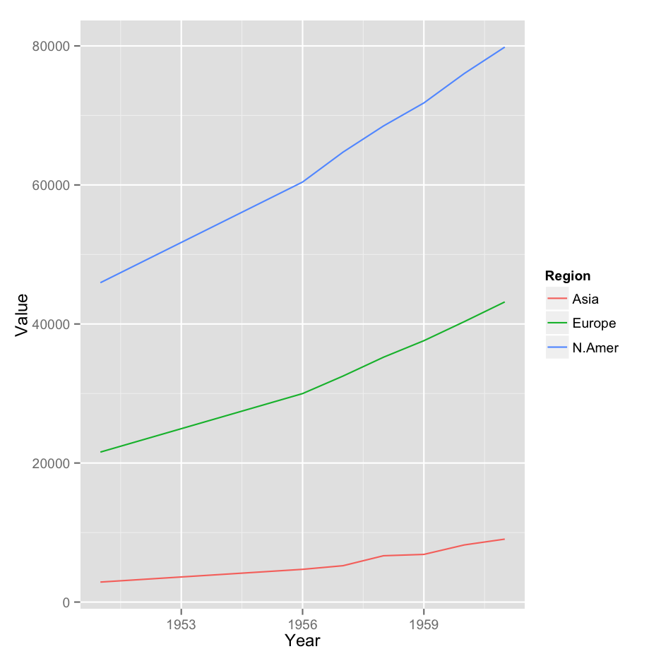

---

## More grouping var: linetype

```r
ggplot(WP.long, aes(x=Year, y=Value, linetype=Region)) + geom_line()
```


---

## Again, beware of categorical x!

```r
ggplot(WP.long, aes(x=factor(Year), y=Value, linetype=Region, group=Region)) + geom_line()
```


---

## Reverse order of legend labels

```r
ggplot(WP.long, aes(x=Year, y=Value, linetype=Region)) + geom_line() +
  guides(linetype=guide_legend(reverse=TRUE))
```

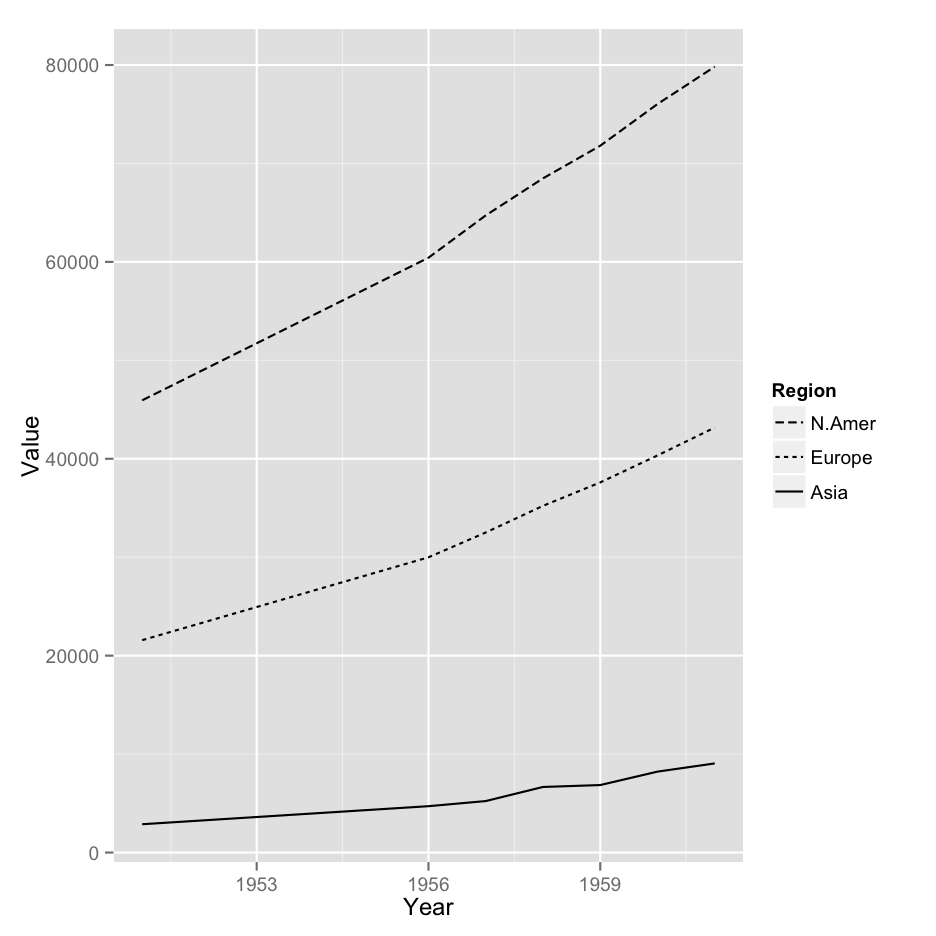

---

## Exercise: Real wage trending down...

```r
data("salary", package="DSC2014Tutorial") # or load('salary.RData')
plot(x=salary_cpi$year, y=salary_cpi$salary, type='l', xlab='Year', ylab='Wage')
lines(x=salary_cpi$year, y=salary_cpi$real_wage, col='red')
legend('bottomright', c('Nominal', 'Real'), lty=c(1,1), col=c('black','red'), inset=.02)
```

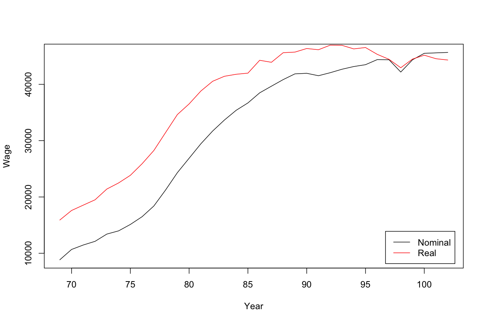

---

## Exercise: Try to plot this!


---

## Exercise: Answer

```r
# preprocessing is necessary
tmp <- salary_cpi[, c(1,2,4)]
tmp <- cbind(stack(tmp[, 2:3]), tmp$year)
colnames(tmp) <- c('Value', 'Type', 'Year')

# plot the long-formatted data
ggplot(tmp, aes(x=Year, y=Value, color=Type)) + # use color as grouping var
  geom_line() +
  labs(ylab='NT dollars', title='Real Wage Trending Down...') +
  # manually modify legend info:
  # scale_x_discrete where x is the grouping var which, in this case, is color
  scale_color_discrete(name='Salary Type', labels=c('Real', 'Nominal')) +
  
  # this will be covered latter
  annotate('rect', xmin=97, xmax=99, ymin=-Inf, ymax=Inf, fill='blue', alpha=.25) +
  annotate('text', label='try ?annotate for help', size=8, vjust=-.25, x=98, y=10000)
```

--- .segue .nobackground .dark

## Scatter Plot

---

## IMDB data

```r
movies1 <- movies[!is.na(movies$budget),]
ggplot(movies1, aes(x=budget, y=rating)) + geom_point()
```

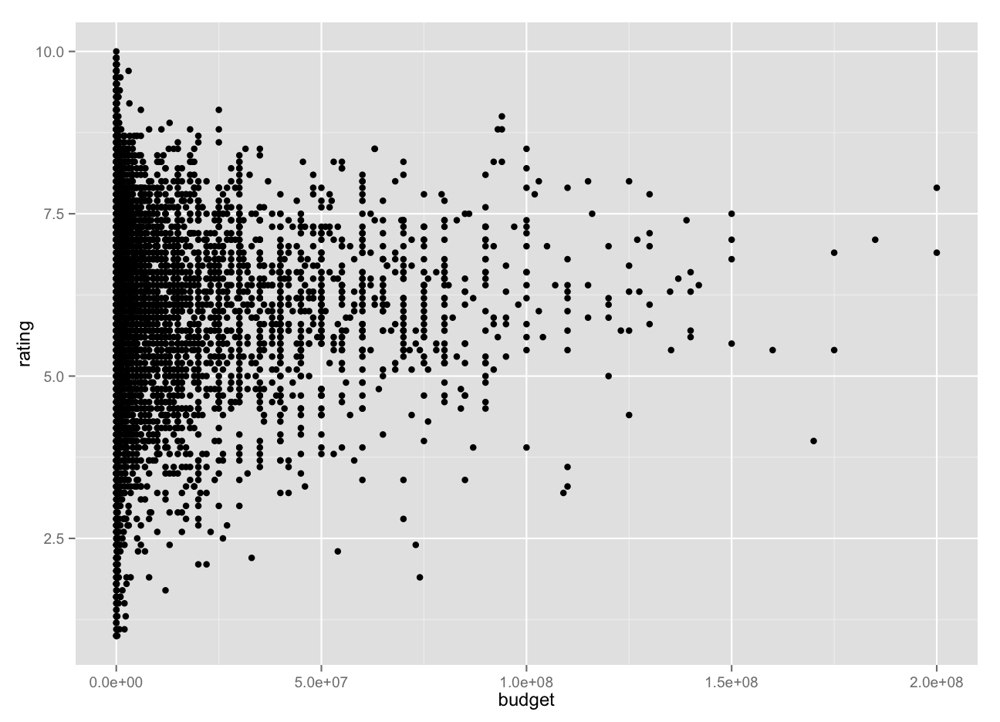

---

## Control the shape & size of points

```r
ggplot(movies1, aes(x=budget, y=rating)) + geom_point(shape=5, size=3)
```


---

## All point shape types in `ggplot2`


---

## Grouping: by binary variable
# This usually happens accidentally.

```r
ggplot(movies1, aes(x=budget, y=rating, color=Action)) + geom_point()
```


---

## Grouping: by categarical variable

```r
ggplot(movies1, aes(x=budget, y=rating, color=factor(Action))) + 
  geom_point() + labs(color='Action Movie?')
```

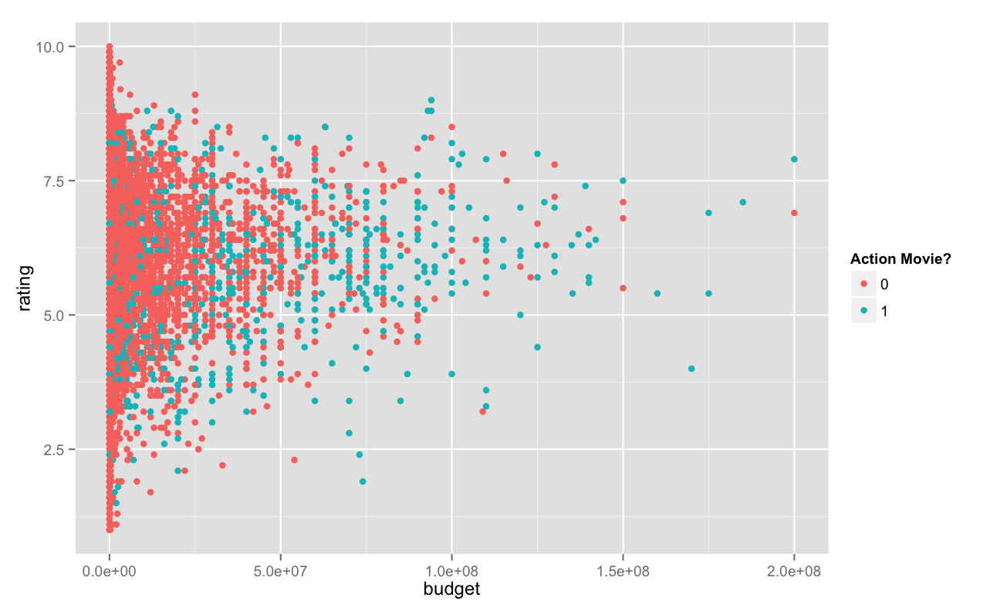

---

## Multi-grouping

```r
ggplot(movies1, aes(x=budget, y=rating, color=factor(Action), shape=(length > 120))) + 
  geom_point(size=3) + labs(color='Action Movie?')
```


---

## Fit regression line

```r
ggplot(movies, aes(x=votes, y=rating)) + geom_point() +
  stat_smooth(method=lm, level=.95) # add se=FALSE to disable CI
```


---

## The default is a polynomial fit

```r
ggplot(movies, aes(x=votes, y=rating)) + geom_point() + stat_smooth()
```


---

## Fitting is smart to align with grouping

```r
ggplot(movies1, aes(x=budget, y=rating, color=factor(Action))) + 
  geom_point() + labs(color='Action Movie?') + stat_smooth(method=lm, se=FALSE)
```


---

## What if the model is pre-computed?

```r
lm_model <- lm(rating ~ budget, data=movies1)
ggplot(movies1, aes(x=budget, y=rating)) + geom_point() +
  geom_line(aes(x=budget, y=lm_model$fitted.values), color='blue')
```


---

## Scatter plot "as is": Using `geom_text`

```r
starmovies <- movies[movies$votes > mean(movies$votes),]
starmovies <- starmovies[order(-starmovies$rating),][1:10,]
ggplot(starmovies, aes(x=votes, y=rating)) + geom_point() + geom_text(aes(label=title))
```


---

## Fine-tune

```r
ggplot(starmovies, aes(x=votes, y=rating)) + geom_point(color='red') + 
  geom_text(aes(label=title), hjust=0, vjust=0, angle=20) +
  xlim(0, max(starmovies$votes)*2) +
  ylim(min(starmovies$rating), 9.2)
```


---

## The Final Challenge:
# Which type of film cost the most, averagely?

```r
movietype <- colnames(movies)[18:24]
movies1_singletype <- movies1[rowSums(movies1[, movietype]) == 1,] # remove multi-typed
# mean(movies1_singletype[movies1_singletype$Animation == 1, 'budget'])
lmfit <- lm(as.formula(paste('budget ~', paste(movietype, collapse=' + '))), 
            movies1_singletype)
summary(lmfit)$coef # where is type 'Short'?
```

```
##             Estimate Std. Error t value  Pr(>|t|)
## (Intercept)   396133    1715935  0.2309 8.174e-01
## Action      32302057    2062063 15.6649 7.005e-53
## Animation   31915319    4157723  7.6762 2.317e-14
## Comedy      11525837    1888686  6.1026 1.202e-09
## Drama       10060557    1820528  5.5262 3.604e-08
## Documentary   333572    2881175  0.1158 9.078e-01
## Romance      5207555    3713295  1.4024 1.609e-01
```

---

## Try to plot this!
> What is the association between cost and rating, conditional on type?

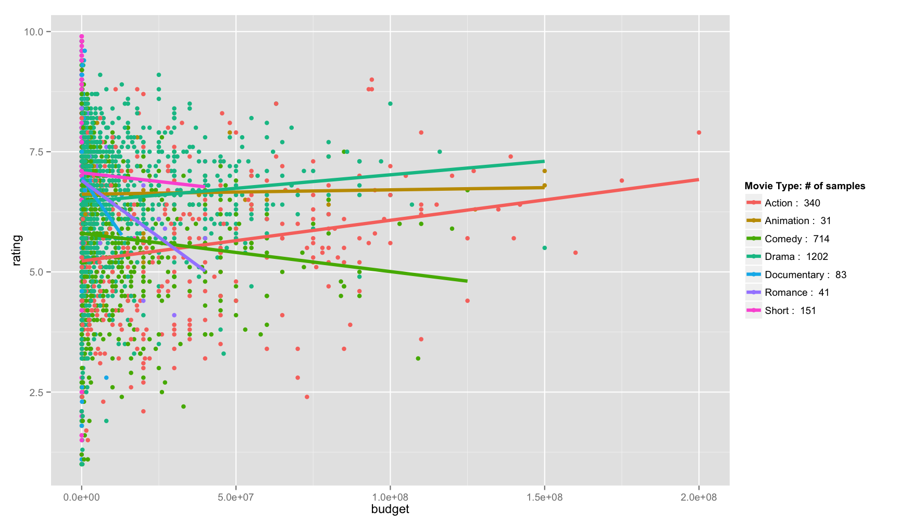

---

## A Hint:
# You need to convert multiple dummies into one factor
+ Before:

```
##     Action Animation Comedy Drama Documentary Romance Short
## 22       0         0      0     1           0       0     0
## 124      0         0      1     0           0       0     0
## 126      0         0      0     1           0       0     0
## 139      0         0      0     0           1       0     0
## 143      0         0      0     1           0       0     0
## 145      0         0      1     0           0       0     0
```
+ After:

```
## [1] Drama       Comedy      Drama       Documentary Drama       Comedy     
## Levels: Action Animation Comedy Drama Documentary Romance Short
```

---

## Exercise: Answer

```r
# convert multiple dummies into one factor as grouping var
# a little matrix operation will do the trick
dummies <- as.matrix(movies1_singletype[, movietype])
movies1_singletype$Type <- factor(dummies %*% (1:length(movietype)), labels=movietype)

# The rest of the task is rather simple
ggplot(movies1_singletype, aes(x=budget, y=rating, color=Type)) + 
  geom_point() +
  
  # set fullrange=T will extend the fitted line outside the sample range
  stat_smooth(method=lm, se=FALSE, fullrange=FALSE, size=1.5) +
  
  # color is the grouping interface, hence scale_color_*
  scale_color_discrete(name='Movie Type: # of samples', 
                       labels=paste(levels(movies1_singletype$Type), ': ', 
                                    table(movies1_singletype$Type)))
```

---

## The regression problem behind the scene

```r
interact_terms <- paste(paste(movietype, '*budget', sep=''), collapse=' + ')
lmfit <- lm(as.formula(paste('rating ~', interact_terms)), movies1_singletype)
tail(summary(lmfit)$coef)
```

```
##                      Estimate Std. Error  t value Pr(>|t|)
## Action:budget       1.580e-08  3.332e-08  0.47429   0.6353
## budget:Animation    8.247e-09  3.379e-08  0.24402   0.8072
## budget:Comedy      -6.222e-10  3.337e-08 -0.01865   0.9851
## budget:Drama        1.295e-08  3.333e-08  0.38863   0.6976
## budget:Documentary -8.505e-08  9.010e-08 -0.94389   0.3453
## budget:Romance     -3.983e-08  4.087e-08 -0.97460   0.3299
```
+ None of the interactive term is statistically significant, indeed
+ **Visualization != Analysis** (Our eyes were not born to work on numbers.)
+ Plots can be easily manipluated to be misleading, accidentally or **on purpose**

---

## References
+ [ggplot2 Official document](http://ggplot2.org/)
+ [R Graphics Cookbook](http://www.cookbook-r.com/Graphs/)
+ [Source code of this slide](https://github.com/everdark/lecture_ggplot)
  + The source is tested only on OS X 10.9.3
+ [Introduction to Programming R](https://github.com/everdark/lecture_rintro)
  + Knowlege of general programming is requisite

--- .segue .nobackground .dark

## Bonus: Annotation

---

## Annotation

```r
plot(movies1$budget, movies1$rating) # base solution
abline(h=median(movies1$rating), col='red')
text(x=max(movies1$budget)*.9, y=median(movies1$rating), 
     labels='Median of Rating', col='red', pos=1)
```


---

## Annotation: Add lines

```r
brggp <- ggplot(movies1, aes(x=budget, y=rating)) + geom_point() 
brggp + geom_hline(yintercept=median(movies1$rating)) # ?geom_abline for general setup
# brggp + geom_hline(data=movies1, aes(yintercept=median(rating)))  # the same
# brggp + geom_hline(aes(yintercept=median(movies1$rating)))        # the same
```

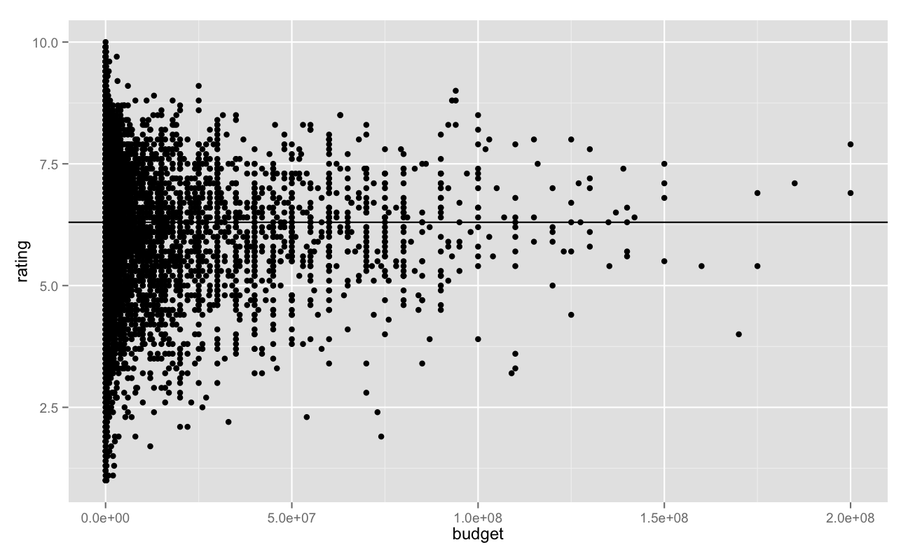

---

## Annotation: Add (single) texts

```r
brggp + geom_hline(yintercept=median(movies1$rating), color='red') + 
  annotate('text', x=Inf, y=median(movies1$rating), 
           label='Medaion of Rating', color='red', vjust=1.2, hjust=1)
# Don't use geom_text for single annotation to avoid overplotting
```

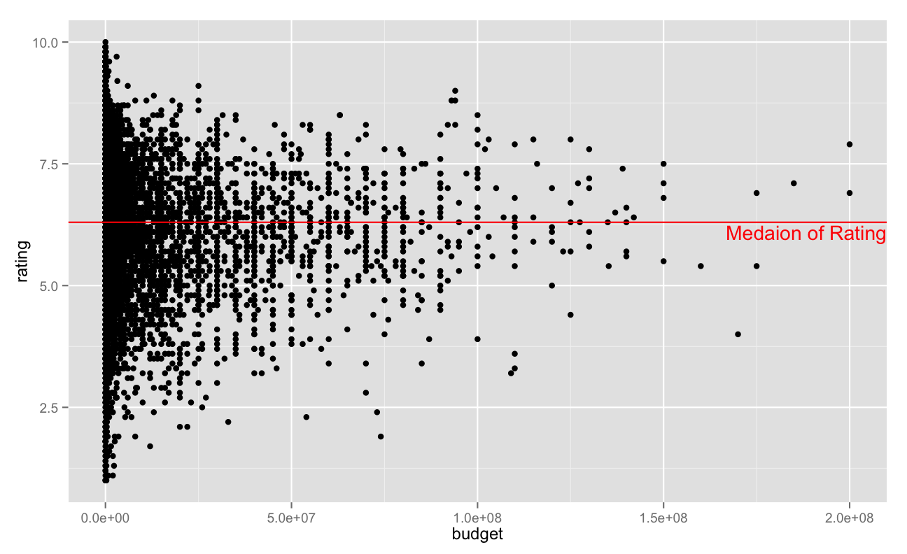

---

## Annotation: Add segments

```r
shaw <- movies1[grep('Shawshank Redemption', movies1$title, fixed=TRUE),]
brggp + annotate('segment', xend=shaw$budget, yend=shaw$rating, x=Inf, y=-Inf,
                 arrow=grid::arrow(), color='red') +
  annotate('text', label='The Shawshank Redemption?', x=Inf, y=-Inf,
           hjust=1.5, vjust=-1, color='red')
```

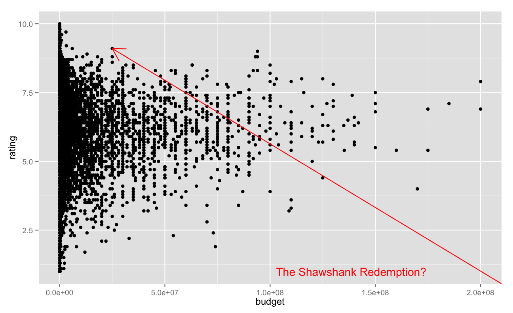

---

## Annotation: Add shaded area

```r
yearcount <- aggregate(title ~ year, data=movies, FUN=length)
ggplot(yearcount, aes(x=year, y=title)) + geom_line() +
  annotate('rect', xmin=1990, xmax=2000, ymin=-Inf, ymax=Inf, fill='blue', alpha=.25)
```


--- .segue .nobackground .dark

## Bonus: Facet / Multi-plotting

---

## Facet: Single grouping

```r
gg <- ggplot(movies1_singletype, aes(x=rating, y=..density..)) + geom_bar()
gg + facet_grid(Action ~ .) # Plot with grouping variable in different window (Vertical)
```


---

## Facet: Single grouping

```r
# Plot with grouping variable in different window (Horizontal)
gg + facet_grid(. ~ Action) 
```

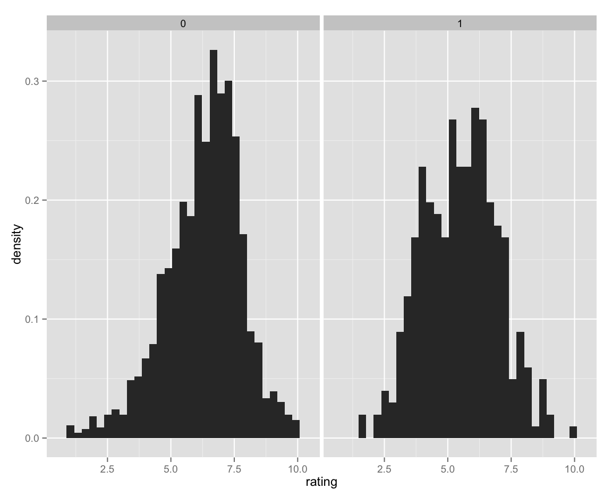

---

## Facet: Multiple grouping

```r
movies1_singletype$modern <- (movies1_singletype$year > 2000)
ggplot(movies1_singletype, aes(x=rating, y=..density..)) + 
  geom_bar() + facet_grid(modern ~ Action)
```


---

## Facet: Multi-layer grouping

```r
movies1_singletype$rated <- (movies1_singletype$mpaa != '')
ggplot(movies1_singletype, aes(x=rating, color=modern)) + 
  geom_line(stat="density") + facet_grid(Type ~ rated)
```

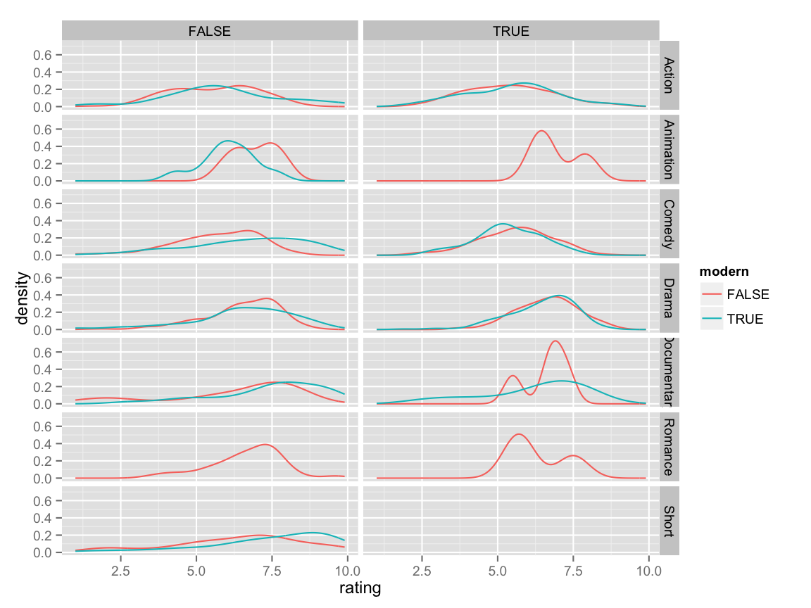

---

## Facet: Change labels
+ Way 1: Change the grouping var in data.frame to reflect the alternate labels
+ Way 2: Write customized labeller function for `facet_grid`

```r
print(label_value) # the default labeller plugg in facet_grid(..., labeller)
```

```
## function (variable, value) 
## as.character(value)
## <environment: namespace:ggplot2>
```

```r
mylabeller <- function(variable, value){
  if ( variable=='rated' ) 
    value <- ifelse(value == TRUE, 'Rated Movies', 'Unrated Movies')
  else if ( variable=='Type' ) 
    as.character(value)
}
```

---

## Facet: Change labels

```r
ggplot(movies1_singletype, aes(x=rating, color=modern)) +
  geom_line(stat="density") + facet_grid(Type ~ rated, labeller=mylabeller)
```

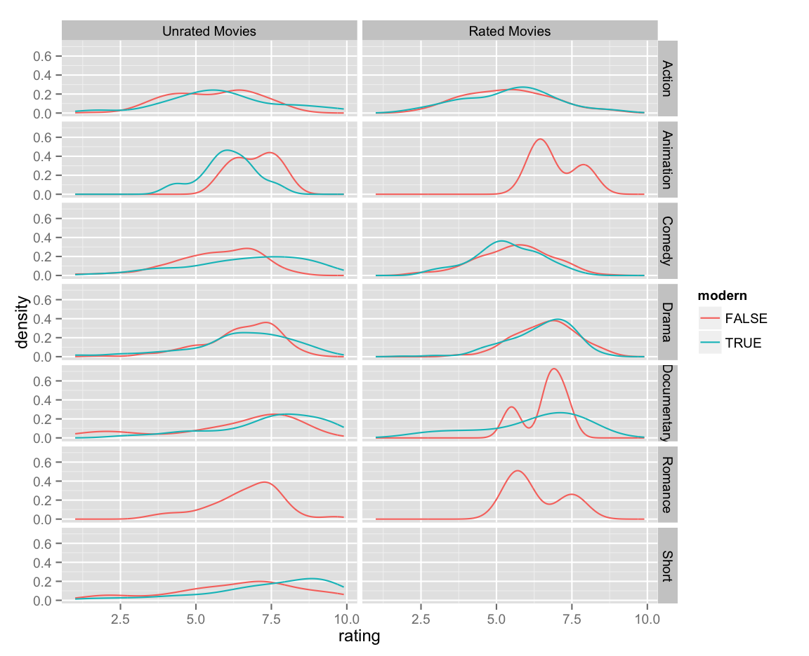

---

## Multi-plotting by `gridExtra` (1/2)


```r
library(gridExtra)
drawPoint <- function(i) {
  ggplot(data.frame(x=1, y=1), aes(x=x,y=y)) + 
    geom_point(shape=i, size=5) +
    ggtitle(sprintf('shape=%s',i)) + 
    theme(axis.text.x=element_blank(), axis.text.y=element_blank()) +
    xlab('') + ylab('')
  }
drawPoint(25)
```

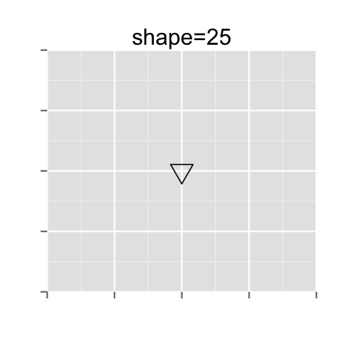

---

## Multi-plotting by `gridExtra` (2/2)


```r
symbol_points <- mapply(drawPoint, 1:25, SIMPLIFY=FALSE)
symbols <- do.call(arrangeGrob, symbol_points)
symbols
```


